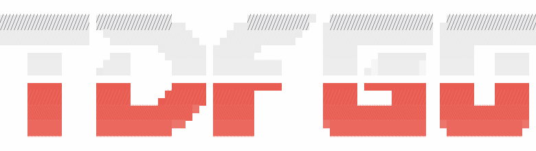
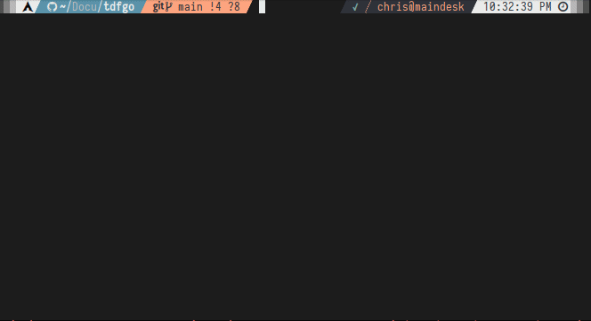
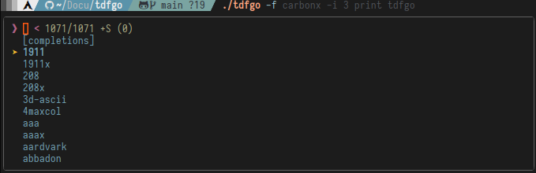
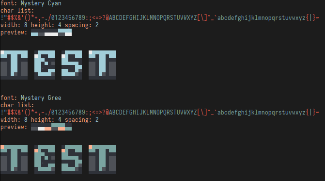
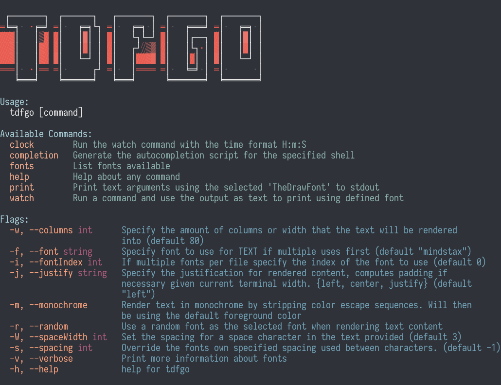
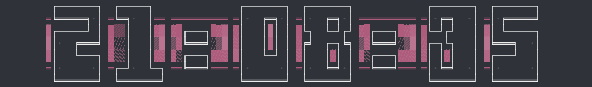
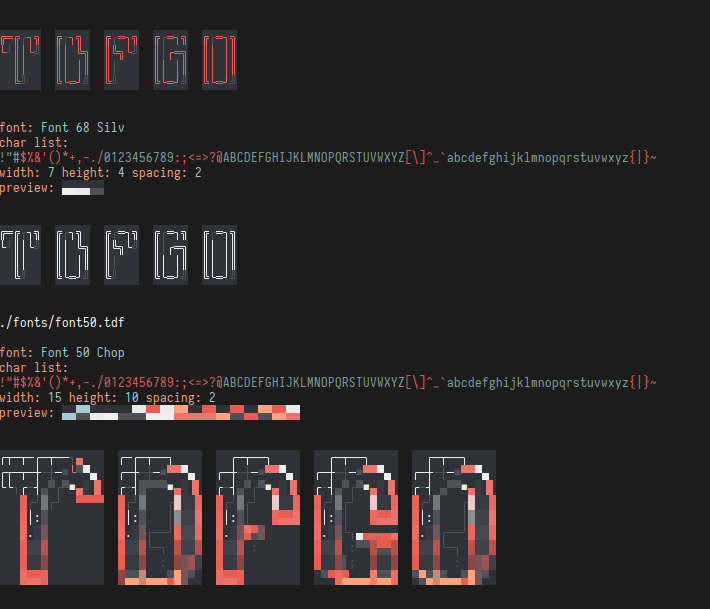

<h1 align="center">
  <a href="https://github.com/digitallyserviced/tdfgo">
    <!-- Please provide path to your logo here -->
    
  </a>
</h1>

<div align="center">
<div align="center">

</div>
  <br />
  <a href="#about"><strong>Explore the screenshots »</strong></a>
  <br />
  <br />
  <a href="https://github.com/digitallyserviced/tdfgo/issues/new?assignees=&labels=bug&template=01_BUG_REPORT.md&title=bug%3A+">Report a Bug</a>
  ·
  <a href="https://github.com/digitallyserviced/tdfgo/issues/new?assignees=&labels=enhancement&template=02_FEATURE_REQUEST.md&title=feat%3A+">Request a Feature</a>
  .
  <a href="https://github.com/digitallyserviced/tdfgo/issues/new?assignees=&labels=question&template=04_SUPPORT_QUESTION.md&title=support%3A+">Ask a Question</a>
</div>

<div align="center">
<br />
  
[](LICENSE)

[](https://github.com/digitallyserviced/tdfgo/issues?q=is%3Aissue+is%3Aopen+label%3A%22help+wanted%22)

[](https://github.com/digitallyserviced)

</div>

<details open="open">
<summary>Table of Contents</summary>

- [About](#about)
  - [Features](#features)
- [Getting Started](#getting-started)
  - [Prerequisites](#prerequisites)
  - [Installation](#installation)
  - [Font Directories](#the-font-directories-searched)
- [Usage](#usage)
  - [`Clock`](#clock)
  - [`Watch`](#watch)
    - [Examples](#watch-examples)
    - [Options](#watch-options)
  - [`Fonts`](#fonts)
    - [Examples](#fonts-examples)
    - [Options](#fonts-options)
- [Support](#support)
- [Project assistance](#project-assistance)
- [Contributing](#contributing)
- [Authors & contributors](#authors--contributors)
- [License](#license)
- [Acknowledgements](#acknowledgements)

</details>

---

## About

[TheDraw](https://en.wikipedia.org/wiki/TheDraw) font parser and console text renderer. This utility was inspired by the [`tdfiglet`](https://github.com/tat3r/tdfiglet) CLI utility. I wanted to also use the fonts in another utility I am working on. 



`tdfiglet` was missing some features and the ability to use more than a single font per file. I realized there was multiple fonts with different color schemes in some of them as well as font packs containing files with lots of different fonts within one font file.

### Features

- Render __TheDraw__ fonts in the terminal
- Supports **COLOR** font types only as they are more plentiful and cooler looking
- Configure spacing between characters, the size a ` `(space) character takes up in text 
- Use a random font for content
- Supported characters and a missing character view available when listing fonts to find a font that contains the necessary characters.
- `print` - use arguments or stdin as the text content to render
- `watch` - specify a command to repeat and render the output (clocks, status, live banner)
- `clock` - alias to print `date +%H:%m:%S` to the console (tmux lock, console clock) `./tdfgo clock`
- `fonts` - dump the list of fonts available with information about the font and coloring previews `./tdfgo fonts -v`
- Preview fonts when dumping the list with customizable content `./tdfgo fonts -vp -t text`
- Shell completion of all flags and commands, completion of font file names found, completion of fonts found within a single font file 
<!--  -->

<details>
<summary>Screenshots</summary>
<br>

> **[?]**
> Please provide your screenshots here.

|                             Zsh / Bash / Fish Completion                               |                               Font Dump Verbose with Preview                               |
| :-------------------------------------------------------------------: | :--------------------------------------------------------------------: |
|  |  |

</details>

### Built With

> Go 1.18
> Neovim
> Arch Linux

## Getting Started

### Prerequisites

> Go 1.18

### Installation

> **[?]**
> Clone the repo and get started

```bash
git clone https://github.com/digitallyserviced/tdfgo.git
cd tdfgo
go build
./tdfgo fonts -vp -t YOURTEXT
```

The utility searches [Font Directories](#the-font-directories-searched) for available fonts. Launch the utility from the cloned directory or copy fonts into one of the defined directories to be able to use them from anywhere. 

> I plan to get an installer going soon.

## Usage



#### Options

```bash
  -w, --columns int      Specify the amount of columns or width that the text will be rendered into (default 80)
  -f, --font string      Specify font to use for TEXT if multiple uses first (default "mindstax")
  -i, --fontIndex int    If multiple fonts per file specify the index of the font to use (default 0)
  -h, --help             help for tdfgo
  -j, --justify string   Specify the justification for rendered content, computes padding if necessary given current terminal width. {left, center, justify} (default "left")
  -m, --monochrome       Render text in monochrome by stripping color escape sequences. Will then be using the default foreground color
  -r, --random           Use a random font as the selected font when rendering text content
  -W, --spaceWidth int   Set the spacing for a space character in the text provided (default 3)
  -s, --spacing int      Override the fonts own specified spacing used between characters. (default -1)
  -v, --verbose          Print more information about fonts
```

### `Clock`



Using the selected font and specified options output a clock to the terminal

```bash
# Center the clock using the yazoox font and use font #4 (0 based index)
tdfgo -j center -f yazoox -i 3 clock
```

### `Watch`

Run a command every # interval and use the output as the text rendered using a font

```
tdfgo watch [-i interval] CMD args... [flags]
```

#### `Watch` Examples

```
# console clock
tdfgo watch -n 1s 'date "+%H:%m:%S"'
tdfgo clock

# print ONLINE or OFFLINE based off ping success
tdfgo watch 'ping -c1 -w 1 google.com>/dev/null 2>&1 && echo -n ONLINE || echo -n OFFLINE'

# print 1min load avg every 0.5 seconds
tdfgo watch 'cat /proc/loadavg | cut -d" " -f 1'

```

#### `Watch` Options

```
  -h, --help                help for watch
  -n, --interval duration   Interval between executions of the specified command (default 1s)
```

### `Fonts`



List all available fonts found in the default directories

```bash
tdfgo fonts [-v] [-p] [-t text] [-X] [pattern] 
```

#### `Fonts` Examples

```bash
# list fonts with impact in name
tdfgo fonts impact

# list fonts with much more information
tdfgo fonts -v

# list fonts with a preview output using default string "Preview"
tdfgo fonts -p

# list fonts with information about required characters specified by -t
# useful to find fonts having all the characters you need
tdfgo fonts -p -X -t "!@#$JDKALFK@{}"
```

#### `Fonts` Options

```
  -X, --checkChars    Check fonts to see if they are missing any characters in the defined preview text
  -h, --help          help for fonts
  -p, --preview       Output a preview for the fonts
  -t, --text string   Sample string to use for previewing fonts (default "Preview")
```

##### The font directories searched:

- `.` 
- `./fonts`
- `/usr/share/tdfgo/fonts`
- `/usr/local/share/tdfgo/fonts`
- `~/.config/tdfgo/fonts`
- Built-in (There are two fonts `mindstax.tdf` and `yazoox.tdf` embedded within the binary for use anywhere)

## Support

Reach out to the maintainer at one of the following places:

- [GitHub issues](https://github.com/digitallyserviced/tdfgo/issues/new?assignees=&labels=question&template=04_SUPPORT_QUESTION.md&title=support%3A+)
- Contact options listed on [this GitHub profile](https://github.com/digitallyserviced)

## Project assistance

If you want to say **thank you** or/and support active development of TDFGO:

- Add a [GitHub Star](https://github.com/digitallyserviced/tdfgo) to the project.
- Tweet about the TDFGO.
- Write interesting articles about the project on [Dev.to](https://dev.to/), [Medium](https://medium.com/) or your personal blog.

Together, we can make TDFGO **better**!

## Contributing

First off, thanks for taking the time to contribute! Contributions are what make the open-source community such an amazing place to learn, inspire, and create. Any contributions you make will benefit everybody else and are **greatly appreciated**.

## Authors & contributors

The original setup of this repository is by [DigitallyServiced](https://github.com/digitallyserviced).

For a full list of all authors and contributors, see [the contributors page](https://github.com/digitallyserviced/tdfgo/contributors).

## License

This project is licensed under the **Creative Commons**.

See [LICENSE](LICENSE) for more information.

## Acknowledgements

> The CLI utility [tdfiglet](https://github.com/tat3r/tdfiglet) which introduced me to TheDraw fonts

> The great CLI editor [Neovim](https://github.com/neovim/neovim) which allows me to ditch a mouse

> The great [wezterm](https://github.com/wez/wezterm) terminal emulator which is beautiful and acts as my WM, status bar, modal dialogs, my everything...

> [RoySAC](http://roysac.com/) for [TheDraw Font File Spec](http://www.roysac.com/blog/2014/04/thedraw-fonts-file-tdf-specifications/) and fonts and other great info about ASCII/ANSI art. As well as his [Font Utility](https://sourceforge.net/p/ansi-text-editor/svn/HEAD/tree/ANSI-EditorSDK/Classes/Fonts/TDF/TDFFontFile.vb) which provided me some code insight into the font file definition.

> [WAB Ansi Logo Maker](https://github.com/N0NameN0/WAB_Ansi_Logo_Maker/blob/main/index.php) which also had inisght into the TheDraw font spec in javascript

> [textimg](https://github.com/jiro4989/textimg) for making renderings of the fonts in images

> [asciinema](https://github.com/asciinema/asciinema) for the console recorder to make the preview gifs

> [asciinema gif generator](https://github.com/asciinema/agg) for the asciinema asciicast gif generator

> [EdenEast nightfox color schemes](https://github.com/EdenEast/nightfox.nvim) for terafox and carbonfox themes that all the images/gifs use as the wezterm console color schemes
